## 🎓 Project Overview (Sanitized for Academic Review)

**AIQC TEND** is an AI-powered QA automation system that automates **bug reproduction and verification** from **Jira** tickets using **LLMs (Gemini + OpenAI)** and **Playwright** browser automation, with **human-in-the-loop** control via **Google Chat**. The goal is to shorten QA triage time by turning bug reports (description + video) into executable test steps, running them automatically, and pushing verified evidence back to Jira.

### ✅ What the system does
- **Monitors Jira** for newly assigned tickets (polling schedule)
- Creates a **Google Chat thread** per ticket to collect setup info (env/email/pass/farm) and confirmations
- Uses **LLMs to generate automation steps**:
  - **Text → Actions**: parse setup instructions into structured JSON actions
  - **Video → Actions**: analyze the Jira bug video to extract reproduction actions
- Executes actions using **Playwright (Chromium)**, records a **run video**, and handles timeouts with **human intervention** (“do this manually → reply `done` to resume”)
- Performs **verification** by comparing the recorded run vs the original bug video (LLM-assisted semantic comparison + optional heuristic signals)
- Posts the final result (bug reproduced / not reproduced), **steps to reproduce**, and evidence back to **Chat**, then (upon approval) **uploads to Jira** (comment + attachment + transition)

### 🧠 Key technical ideas
- **Multi-LLM orchestration**: OpenAI for structured parsing, Gemini for video understanding and comparison
- **Structured action format** (JSON) as a bridge between natural language/video signals and executable automation
- **Robust execution loop**: timeout detection, recovery policy, human-in-the-loop checkpointing
- **Evidence-first QA**: every run produces a recorded video artifact for auditability

### 🔬 Research angle (how this can be studied)
- **UI video → automation action extraction** (multi-modal grounding)
- **Reliability under uncertainty**: flaky UI, timing issues, selector brittleness, recovery strategies
- **Human-in-the-loop policies** to maximize success while keeping QA in control
- **Evaluation metrics**: reproduction accuracy, automation success rate, time-to-triage saved, cost per ticket

### 🚧 Limitations & next steps
- Hard cases: dynamic pages, multi-tab flows, changing selectors, auth/captcha, inconsistent videos
- Next improvements: stronger DOM grounding + self-healing selectors, benchmark dataset of bug videos/steps, queueing + concurrency control, CI integration and artifact storage
### Detailed Internal Processing Flow

```mermaid
flowchart TB
  %% Jira polling & thread bootstrap
  A["🔄 Schedule: poll_jira_for_new_tickets<br/>(Every 1 minute)"] --> B{New Ticket<br/>Found?}
  B -->|No| A
  B -->|Yes| C["📝 handle_new_assignment(ticket)<br/>Status: awaiting_setup_info"]
  
  C --> D["💬 Create Google Chat Thread"]
  D --> E["📋 Request Setup Info<br/>(env/email/pass/farm/page)"]
  
  %% User provides setup
  E --> F{User Replies<br/>with Setup?}
  F -->|Yes| G["⚙️ worker_gen_steps_and_confirm<br/>Status: generating_steps"]
  
  %% Gen steps from setup + video
  subgraph AI_Generation ["🤖 AI Step Generation"]
    G --> H1["📝 OpenAI: openai_text_to_actions<br/>(Parse Email/Pass/Farm)"]
    G --> H2["🎬 Gemini: gemini_analyze_video_and_actual<br/>(Extract actions from Jira video)"]
    H1 --> I["🔗 Merge Actions<br/>final_actions = setup + bug_actions"]
    H2 --> I
    I --> J["📖 Gemini: actions_to_english_steps<br/>(Translate to readable steps)"]
  end
  
  J --> K["✅ Display Steps to User<br/>Status: awaiting_step_confirmation"]
  
  %% User confirms or provides manual steps
  K --> L{User Response?}
  L -->|"yes"| M["🚀 worker_run_automation_and_compare<br/>Status: running"]
  L -->|"no"| N["✍️ Status: awaiting_manual_steps<br/>(Request manual input)"]
  L -->|timeout| O["⏰ Timeout - Keep waiting"]
  O --> K
  
  N --> P{User Provides<br/>Manual Steps?}
  P -->|Yes| Q["🔄 Gemini: text_steps_to_actions<br/>(Convert text → JSON actions)"]
  Q --> M
  
  %% Automation & video recording
  subgraph Playwright_Automation ["🎭 Playwright Execution"]
    M --> R["🌐 Launch Browser + Start Recording"]
    R --> S["▶️ _run_actions_with_playwright_<br/>(Execute actions sequentially)"]
    S --> T{Action<br/>Timeout?}
    T -->|No| U{More<br/>Actions?}
    U -->|Yes| S
    T -->|Yes| V["⏸️ Status: waiting_for_human_input<br/>Post to Chat: 'Please do X manually'"]
    V --> W{User Types<br/>'done'?}
    W -->|Yes| X["▶️ Resume Automation<br/>(Continue next action)"]
    X --> U
    U -->|No| Y["🎬 Save Video Recording<br/>(WebM → MP4 conversion)"]
  end
  
  %% Video comparison
  Y --> Z["🔍 Gemini: gemini_compare_videos<br/>(Compare old vs new video)"]
  Z --> AA["📊 Generate Analysis Report"]
  
  %% Present results
  AA --> AB["💬 Post Results to Chat<br/>Status: awaiting_confirmation"]
  AB --> AC["📋 Show:<br/>- Bug reproduced? (Yes/No)<br/>- Steps to reproduce<br/>- AI analysis<br/>- Ask: Confirm to push?"]
  
  %% User confirmation
  AC --> AD{User<br/>Response?}
  AD -->|"yes"| AE["📤 Upload Video to Jira"]
  AE --> AF["💬 Post Comment (ADF format)"]
  AF --> AG["🔄 Transition Ticket<br/>(AutoFlow → assign to QA)"]
  AG --> AH["✅ Status: pushed / done"]
  
  AD -->|"no"| AI["🔁 worker_rerun_comparison_only<br/>(Stricter visual comparison)"]
  AI --> AJ["🔍 Gemini: compare_videos_stricter<br/>(More detailed analysis)"]
  AJ --> AB
  
  AD -->|"rerun"| AK["🔄 Full Rerun<br/>(Go back to automation)"]
  AK --> M
  
  %% Error handling
  S -.->|Error| AL["❌ Capture Error Video"]
  AL --> AM["💬 Post Error to Chat<br/>+ Debug video link"]
  AM --> K
  
  style A fill:#e1f5ff
  style G fill:#fff4e1
  style M fill:#ffe1f5
  style Z fill:#e1ffe1
  style AH fill:#90EE90
```

### Workflow 5: Complete System Interaction (End-to-End)

```mermaid
sequenceDiagram
    participant Schedule as ⏰ Scheduler
    participant Jira as 📋 Jira API
    participant Bot as 🤖 Chatbot
    participant GChat as 💬 Google Chat
    participant User as 👤 QA User
    participant OpenAI as 🧠 OpenAI GPT-4
    participant Gemini as 🎬 Gemini Pro
    participant PW as 🎭 Playwright
    
    %% Polling Phase
    Schedule->>Jira: Poll: Get tickets assigned to me
    Jira-->>Schedule: [TEND-12345, TEND-12346]
    Schedule->>Bot: New ticket: TEND-12345
    
    %% Bootstrap Phase
    Bot->>Jira: GET /issue/TEND-12345
    Jira-->>Bot: {summary, description, attachments[video.mp4]}
    Bot->>Bot: Download video.mp4 from Jira
    Bot->>GChat: Create thread in QC space
    GChat-->>User: "New ticket TEND-12345<br/>Please provide: Env, Email, Password, Farm"
    
    %% Setup Phase
    User->>GChat: "Env: staging<br/>Email: test@app.com<br/>Pass: pass123<br/>Farm: TestFarm"
    GChat->>Bot: Message event webhook
    Bot->>Bot: Parse setup info
    
    %% AI Generation Phase
    Bot->>OpenAI: "Extract actions from: Email: test@app.com..."
    OpenAI-->>Bot: [fillByLabel(Email), fillByLabel(Password), clickText(Login), clickText(TestFarm)]
    
    Bot->>Gemini: Upload video.mp4 + "Extract bug reproduction actions"
    Gemini-->>Bot: [clickText(Reports), clickText(Sales), clickText(Export)]
    
    Bot->>Bot: Merge: setup_actions + bug_actions
    Bot->>Gemini: "Translate actions to English steps"
    Gemini-->>Bot: "1. Enter email...\n2. Enter password..."
    
    Bot->>GChat: "Generated steps:\n1. Enter email\n2. Enter password...\n\nConfirm? (yes/no)"
    GChat-->>User: Show generated steps
    User->>GChat: "yes"
    GChat->>Bot: Message event: "yes"
    
    %% Automation Phase
    Bot->>PW: Launch Chromium + Start recording
    PW-->>Bot: Browser ready
    Bot->>PW: Execute action 1: fillByLabel(Email, test@app.com)
    PW-->>Bot: ✅ Success
    Bot->>PW: Execute action 2: fillByLabel(Password, pass123)
    PW-->>Bot: ✅ Success
    Bot->>PW: Execute action 3: clickText(Login)
    PW-->>Bot: ✅ Success
    Bot->>PW: Execute action 4: clickText(TestFarm)
    PW-->>Bot: ✅ Success
    Bot->>PW: Execute action 5: clickText(Reports)
    PW-->>Bot: ⏱️ TimeoutError
    
    %% Human Intervention
    Bot->>GChat: "⏸️ Timeout on action 5/7<br/>Please click 'Reports' manually<br/>Type 'done' when finished"
    GChat-->>User: Show timeout message
    User->>User: Manually clicks Reports
    User->>GChat: "done"
    GChat->>Bot: Message event: "done"
    Bot->>PW: Resume - Execute action 6: clickText(Sales)
    PW-->>Bot: ✅ Success
    Bot->>PW: Execute action 7: clickText(Export)
    PW-->>Bot: ✅ Success
    
    Bot->>PW: Save video recording
    PW-->>Bot: recorded_video.webm
    Bot->>Bot: Convert webm → mp4
    
    %% Comparison Phase
    Bot->>Gemini: Upload old_video.mp4 + recorded_video.mp4<br/>"Compare these videos and determine if bug is reproduced"
    Gemini-->>Bot: {is_bug: true, reason: "Export button shows error as expected"}
    
    %% Result Phase
    Bot->>GChat: "🐞 Bug Reproduced!<br/><br/>Steps to reproduce:<br/>1. Enter email...<br/><br/>AI Analysis:<br/>Export button shows error...<br/><br/>Confirm to push? (yes/no)"
    GChat-->>User: Show results
    User->>GChat: "yes"
    GChat->>Bot: Message event: "yes"
    
    %% Push to Jira Phase
    Bot->>Jira: POST /issue/TEND-12345/attachments<br/>(Upload recorded_video.mp4)
    Jira-->>Bot: Attachment uploaded
    Bot->>Jira: POST /issue/TEND-12345/comment<br/>(ADF format comment with steps)
    Jira-->>Bot: Comment added
    Bot->>Jira: POST /issue/TEND-12345/transitions<br/>(Move to "Done" + assign to QA)
    Jira-->>Bot: Ticket updated
    
    Bot->>GChat: "✅ Successfully pushed to Jira!<br/>Ticket TEND-12345 is now Done"
    GChat-->>User: Show success message
```

### 🚀 Deployment (high-level)
Runs 24/7 on **AWS EC2 (Ubuntu)** using **systemd** (auto-restart + auto-start on reboot) behind **Nginx**. **Playwright runs headless** on servers (no X display).
